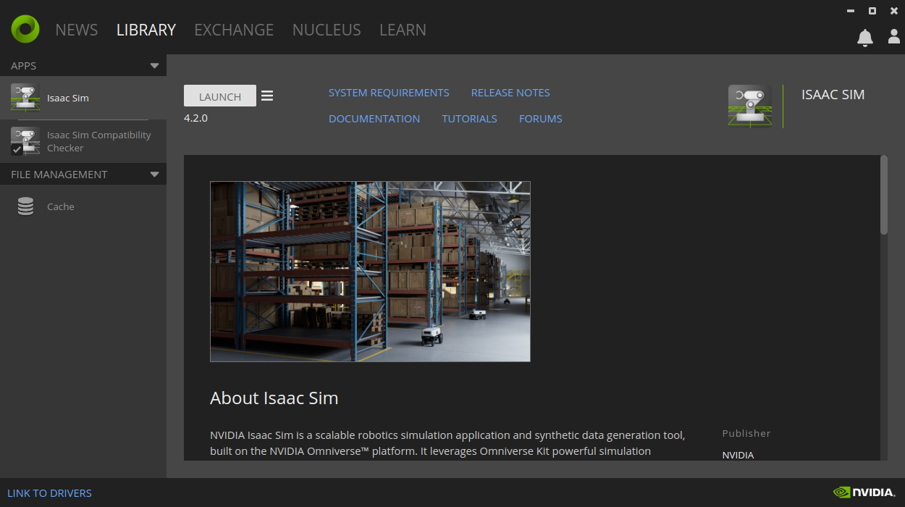

# Piper_isaac_sim

测试系统配置：ubuntu22.04+4060显卡

**NOTE:当前模型没有颜色**

## 1、配置系统环境

### 1）安装显卡驱动

[下载链接](https://www.nvidia.com/Download/index.aspx)

### 2）下载NVIDIA Omniverse

[下载链接](https://www.nvidia.com/en-us/omniverse/)

### 3）下载isaac sim

> 安装isaac sim之前，可以使用ISAAC SIM COMPATIBILITY CHECKER检查一下，电脑配置是否满足要求

在Omniverse里面下载isaac sim


下载完成之后可以启动isaac sim



### 下载代码

```
https://github.com/agilexrobotics/piper_isaac_sim.git
```

### 4）启动isaac sim，导入USD


打开isacc sim之后，在content中找到存放USD的路径，双击打开


成功导入后，点击三角按钮开始仿真
